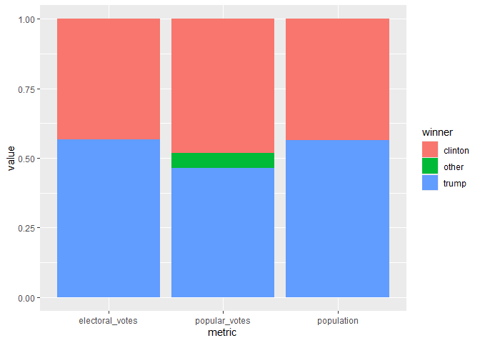

assignment-7
================
Gisela Noguera Toffoletti

Assignment 7: Relational data plus revisiting data wrangling and
visualization ================

``` r
library(tidyverse)
library(knitr)
library(dslabs)
```

<br>

## Excercise: 2016 election result and polling

For this exercise, we will explore the result of the 2016 US
presidential election as well as the polling data. We will use the
following three datasets in the `dslabs` package, and use `join`
function to connect them together. As a reminder, you can use `?` to
learn more about these datasets.

- `results_us_election_2016`: Election results (popular vote) and
  electoral college votes from the 2016 presidential election.

- `polls_us_election_2016`: Poll results from the 2016 presidential
  elections.

- `murders`: Gun murder data from FBI reports. It also contains the
  population of each state.

We will also use [this
dataset](https://raw.githubusercontent.com/kshaffer/election2016/master/2016ElectionResultsByState.csv)
to get the exact numbers of votes for question 3.

<br>

### Question 1. What is the relationship between the population size and the number of electoral votes each state has?

**1a.** Use a `join` function to combine the `murders` dataset, which
contains information on population size, and the
`results_us_election_2016` dataset, which contains information on the
number of electoral votes. Name this new dataset `q_1a`, and show its
first 6 rows.

``` r
q_1a <- murders |> 
  left_join(results_us_election_2016, join_by(state))
head(q_1a)
```

    ##        state abb region population total electoral_votes clinton trump others
    ## 1    Alabama  AL  South    4779736   135               9    34.4  62.1    3.6
    ## 2     Alaska  AK   West     710231    19               3    36.6  51.3   12.2
    ## 3    Arizona  AZ   West    6392017   232              11    45.1  48.7    6.2
    ## 4   Arkansas  AR  South    2915918    93               6    33.7  60.6    5.8
    ## 5 California  CA   West   37253956  1257              55    61.7  31.6    6.7
    ## 6   Colorado  CO   West    5029196    65               9    48.2  43.3    8.6

<br> <br>

**1b.** Add a new variable in the `q_1a` dataset to indicate which
candidate won in each state, and remove the columns `abb`, `region`, and
`total`. Name this new dataset `q_1b`, and show its first 6 rows.

``` r
q_1b <- q_1a |> 
  mutate(winner = ifelse(clinton > trump, "clinton", "trump")) |> 
  select(state, population, electoral_votes, clinton, trump, others, winner)
head(q_1b)
```

    ##        state population electoral_votes clinton trump others  winner
    ## 1    Alabama    4779736               9    34.4  62.1    3.6   trump
    ## 2     Alaska     710231               3    36.6  51.3   12.2   trump
    ## 3    Arizona    6392017              11    45.1  48.7    6.2   trump
    ## 4   Arkansas    2915918               6    33.7  60.6    5.8   trump
    ## 5 California   37253956              55    61.7  31.6    6.7 clinton
    ## 6   Colorado    5029196               9    48.2  43.3    8.6 clinton

<br> <br>

**1c.** Using the `q_1b` dataset, plot the relationship between
population size and number of electoral votes. Use color to indicate who
won the state. Fit a straight line to the data, set its color to black,
size to 0.1, and turn off its confidence interval.

``` r
q_1b |> 
  ggplot(mapping = aes(x = population, y = electoral_votes, colour = winner)) +
  geom_point() +
  geom_smooth(method = "lm", se = F, linewidth = 0.1, colour = "black")
```

<!-- -->

<br> <br>

### Question 2. Would the election result be any different if the number of electoral votes is exactly proportional to a state’s population size?

**2a.** First, convert the `q_1b` dataset to longer format such that the
`population` and `electoral_votes` columns are turned into rows as shown
below. Name this new dataset `q_2a`, and show its first 6 rows.

``` r
q_2a <- q_1b |> 
  pivot_longer(c("population", "electoral_votes"), names_to = "metric", values_to = "value") |> 
  select(state, clinton, trump, others, winner, metric, value)
head(q_2a)
```

    ## # A tibble: 6 × 7
    ##   state   clinton trump others winner metric            value
    ##   <chr>     <dbl> <dbl>  <dbl> <chr>  <chr>             <dbl>
    ## 1 Alabama    34.4  62.1    3.6 trump  population      4779736
    ## 2 Alabama    34.4  62.1    3.6 trump  electoral_votes       9
    ## 3 Alaska     36.6  51.3   12.2 trump  population       710231
    ## 4 Alaska     36.6  51.3   12.2 trump  electoral_votes       3
    ## 5 Arizona    45.1  48.7    6.2 trump  population      6392017
    ## 6 Arizona    45.1  48.7    6.2 trump  electoral_votes      11

<br> <br>

**2b.** Then, sum up the number of electoral votes and population size
across all states for each candidate. Name this new dataset `q_2b`, and
print it as shown below.

``` r
q_2b <- q_2a |> 
  group_by(metric, winner) |> 
  summarise(
     value = sum(value))
q_2b
```

    ## # A tibble: 4 × 3
    ## # Groups:   metric [2]
    ##   metric          winner      value
    ##   <chr>           <chr>       <dbl>
    ## 1 electoral_votes clinton       233
    ## 2 electoral_votes trump         305
    ## 3 population      clinton 134982448
    ## 4 population      trump   174881780

<br> <br>

**2c.** Use the `q_2b` dataset to contruct a bar plot to show the final
electoral vote share under the scenarios of **1)** each state has the
number of electoral votes that it currently has, and **2)** each state
has the number of electoral votes that is exactly proportional to its
population size. Here, assume that for each state, the winner will take
all its electoral votes.

<br>

*Hint: `geom_col(position = "fill")` might be helpful.*

``` r
q_2b |> 
  ggplot(aes(metric, value, fill = winner)) +
  geom_col(position = "fill")
```

<!-- -->

<br> <br>

### Question 3. What if the election was determined by popular votes?

**3a.** First, from [this dataset on
GitHub](https://raw.githubusercontent.com/kshaffer/election2016/master/2016ElectionResultsByState.csv),
calculate the number of popular votes each candidate received as shown
below. Name this new dataset `q_3a`, and print it. <br>

*Note: all candidates other than Clinton and Trump are included in
`others` as shown below.*

*Hint: `pivot_longer()` may be useful in here.*

``` r
q_3 <- read_csv("https://raw.githubusercontent.com/kshaffer/election2016/master/2016ElectionResultsByState.csv")
```

``` r
q_3a <- q_3 |> 
  summarise(
    clinton = sum(clintonVotes),
    trump = sum(trumpVotes),
    other = sum(johnsonVotes, steinVotes,mcmullinVotes, othersVotes)
  ) |> 
  mutate(metric = "popular_votes", .before = "clinton") |> 
  pivot_longer(c(clinton,trump,other), names_to = "winner", values_to = "value")
q_3a
```

    ## # A tibble: 3 × 3
    ##   metric        winner     value
    ##   <chr>         <chr>      <dbl>
    ## 1 popular_votes clinton 65125640
    ## 2 popular_votes trump   62616675
    ## 3 popular_votes other    7054974

<br> <br>

**3b.** Combine the `q_2b` dataset with the `q_3a` dataset. Call this
new dataset `q_3b`, and print it as shown below.

``` r
q_3b <- bind_rows(q_2b, q_3a)
q_3b
```

    ## # A tibble: 7 × 3
    ## # Groups:   metric [3]
    ##   metric          winner      value
    ##   <chr>           <chr>       <dbl>
    ## 1 electoral_votes clinton       233
    ## 2 electoral_votes trump         305
    ## 3 population      clinton 134982448
    ## 4 population      trump   174881780
    ## 5 popular_votes   clinton  65125640
    ## 6 popular_votes   trump    62616675
    ## 7 popular_votes   other     7054974

<br> <br>

**3c.** Lastly, use the `q_3b` dataset to contruct a bar plot to show
the final vote share under the scenarios of **1)** each state has the
number of electoral votes that it currently has, **2)** each state has
the number of electoral votes that is exactly proportional to its
population size, and **3)** the election result is determined by the
popular vote.

``` r
q_3b |> 
  ggplot(aes(metric, value, fill = winner)) +
  geom_col(position = "fill")
```

<!-- -->

<br> <br>

### Question 4. The election result in 2016 came as a huge surprise to many people, especially given that most polls predicted Clinton would win before the election. Where did the polls get wrong?

**4a.** The polling data is stored in the data frame
`polls_us_election_2016`. For the sake of simplicity, we will only look
at the data from a single poll for each state. Subset the polling data
to include only the results from the pollster `Ipsos`. Exclude national
polls, and for each state, select the polling result with the `enddate`
closest to the election day (i.e. those with the lastest end date). Keep
only the columns `state`, `adjpoll_clinton`, and `adjpoll_trump`. Save
this new dataset as `q_4a`, and show its first 6 rows.

<br>

*Note: You should have 47 rows in `q_4a` because only 47 states were
polled at least once by Ipsos. You don’t need to worry about the 3
missing states and DC.*

*Hint: `group_by()` and `slice_max()` can be useful for this question.
Check out the help file for `slice_max()` for more info.*

``` r
q_4a <- polls_us_election_2016 |> 
  filter(pollster == "Ipsos") |> 
  group_by(state) |> 
  slice_max(enddate)|> 
  select(state, adjpoll_clinton, adjpoll_trump)
head(q_4a)
```

    ## # A tibble: 6 × 3
    ## # Groups:   state [6]
    ##   state       adjpoll_clinton adjpoll_trump
    ##   <fct>                 <dbl>         <dbl>
    ## 1 Alabama                37.5          53.7
    ## 2 Arizona                41.4          46.2
    ## 3 Arkansas               37.2          53.3
    ## 4 California             58.3          31.0
    ## 5 Colorado               46.0          40.7
    ## 6 Connecticut            48.8          38.9

<br> <br>

**4b.** Combine the `q_4a` dataset with the `q_1b` dataset with a `join`
function. The resulting dataset should only have 47 rows. Create the
following new variables in this joined dataset.

- `polling_margin`: difference between `adjpoll_clinton` and
  `adjpoll_trump`
- `actual_margin`: difference between `clinton` and `trump`
- `polling_error`: difference between `polling_margin` and
  `actual_margin`
- `predicted_winner`: predicted winner based on `adjpoll_clinton` and
  `adjpoll_trump`
- `result = ifelse(winner == predicted_winner, "correct prediction", str_c("unexpected ", winner, " win"))`

Keep only the columns `state`, `polling_error`, `result`,
`electoral_votes`. Name the new dataset `q_4b` and show its first 6
rows.

``` r
q_4b <- q_4a |> 
  left_join(q_1b, join_by(state), unmatched = "drop") |> 
  mutate(
    polling_margin = adjpoll_clinton - adjpoll_trump,
    actual_margin = clinton - trump,
    polling_error = polling_margin - actual_margin,
    predicted_winner = ifelse(adjpoll_trump > adjpoll_clinton, "trump", "clinton"), 
    result = ifelse(winner == predicted_winner, "correct prediction", str_c("unexpected ", winner, " win"))
  ) |> 
  select(state, polling_error, result, electoral_votes)
head(q_4b)
```

    ## # A tibble: 6 × 4
    ## # Groups:   state [6]
    ##   state       polling_error result             electoral_votes
    ##   <chr>               <dbl> <chr>                        <int>
    ## 1 Alabama            11.5   correct prediction               9
    ## 2 Arizona            -1.22  correct prediction              11
    ## 3 Arkansas           10.8   correct prediction               6
    ## 4 California         -2.77  correct prediction              55
    ## 5 Colorado            0.372 correct prediction               9
    ## 6 Connecticut        -3.75  correct prediction               7

<br> <br>

**4c.** Generate the following plot with the `q_4b` dataset. Use chunk
options to adjust the dimensions of the plot to make it longer than the
default dimension. Based on this plot, where did the polls get wrong in
the 2016 election?

**The polls got wrong in 5 states that are Florida, Michigan, Ohio,
Pennsylvania, Wisconsin**

``` r
q_4b |> 
  ggplot(aes(x = polling_error, y = state)) +
  geom_point(aes(colour = result, size = electoral_votes), na.rm = TRUE) +
  scale_colour_discrete(na.translate = FALSE) +
  theme(axis.text.y = element_text(size = 5, hjust = 1))
```

<!-- -->

<br> <br>
