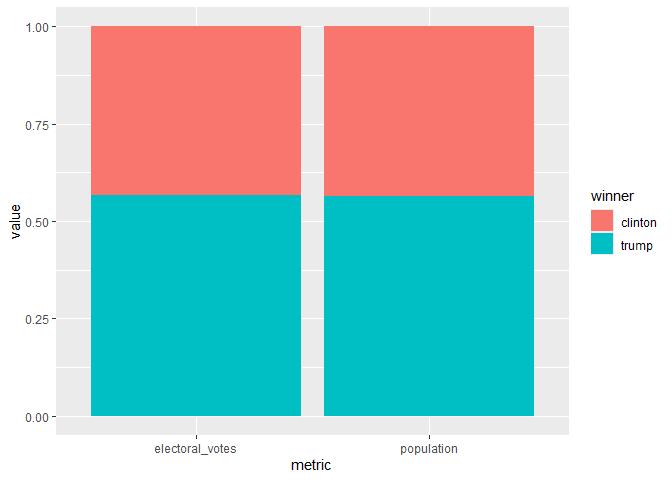

assignment-7
================
Gisela Noguera Toffoletti

Assignment 7: Relational data plus revisiting data wrangling and
visualization ================

``` r
library(tidyverse)
library(knitr)
library(dslabs)
```

<br>

## Excercise: 2016 election result and polling

For this exercise, we will explore the result of the 2016 US
presidential election as well as the polling data. We will use the
following three datasets in the `dslabs` package, and use `join`
function to connect them together. As a reminder, you can use `?` to
learn more about these datasets.

- `results_us_election_2016`: Election results (popular vote) and
  electoral college votes from the 2016 presidential election.

- `polls_us_election_2016`: Poll results from the 2016 presidential
  elections.

- `murders`: Gun murder data from FBI reports. It also contains the
  population of each state.

We will also use [this
dataset](https://raw.githubusercontent.com/kshaffer/election2016/master/2016ElectionResultsByState.csv)
to get the exact numbers of votes for question 3.

<br>

### Question 1. What is the relationship between the population size and the number of electoral votes each state has?

**1a.** Use a `join` function to combine the `murders` dataset, which
contains information on population size, and the
`results_us_election_2016` dataset, which contains information on the
number of electoral votes. Name this new dataset `q_1a`, and show its
first 6 rows.

``` r
q_1a <- murders |> 
  left_join(results_us_election_2016, join_by(state))
head(q_1a)
```

    ##        state abb region population total electoral_votes clinton trump others
    ## 1    Alabama  AL  South    4779736   135               9    34.4  62.1    3.6
    ## 2     Alaska  AK   West     710231    19               3    36.6  51.3   12.2
    ## 3    Arizona  AZ   West    6392017   232              11    45.1  48.7    6.2
    ## 4   Arkansas  AR  South    2915918    93               6    33.7  60.6    5.8
    ## 5 California  CA   West   37253956  1257              55    61.7  31.6    6.7
    ## 6   Colorado  CO   West    5029196    65               9    48.2  43.3    8.6

<br> <br>

**1b.** Add a new variable in the `q_1a` dataset to indicate which
candidate won in each state, and remove the columns `abb`, `region`, and
`total`. Name this new dataset `q_1b`, and show its first 6 rows.

``` r
q_1b <- q_1a |> 
  mutate(winner = ifelse(clinton > trump, "clinton", "trump")) |> 
  select(state, population, electoral_votes, clinton, trump, others, winner)
head(q_1b)
```

    ##        state population electoral_votes clinton trump others  winner
    ## 1    Alabama    4779736               9    34.4  62.1    3.6   trump
    ## 2     Alaska     710231               3    36.6  51.3   12.2   trump
    ## 3    Arizona    6392017              11    45.1  48.7    6.2   trump
    ## 4   Arkansas    2915918               6    33.7  60.6    5.8   trump
    ## 5 California   37253956              55    61.7  31.6    6.7 clinton
    ## 6   Colorado    5029196               9    48.2  43.3    8.6 clinton

<br> <br>

**1c.** Using the `q_1b` dataset, plot the relationship between
population size and number of electoral votes. Use color to indicate who
won the state. Fit a straight line to the data, set its color to black,
size to 0.1, and turn off its confidence interval.

``` r
q_1b |> 
  ggplot(mapping = aes(x = population, y = electoral_votes, colour = winner)) +
  geom_point() +
  geom_smooth(method = "lm", se = F, linewidth = 0.1, colour = "black")
```

<!-- -->

<br> <br>

### Question 2. Would the election result be any different if the number of electoral votes is exactly proportional to a state’s population size?

**2a.** First, convert the `q_1b` dataset to longer format such that the
`population` and `electoral_votes` columns are turned into rows as shown
below. Name this new dataset `q_2a`, and show its first 6 rows.

``` r
q_2a <- q_1b |> 
  pivot_longer(c("population", "electoral_votes"), names_to = "metric", values_to = "value") |> 
  select(state, clinton, trump, others, winner, metric, value)
head(q_2a)
```

    ## # A tibble: 6 × 7
    ##   state   clinton trump others winner metric            value
    ##   <chr>     <dbl> <dbl>  <dbl> <chr>  <chr>             <dbl>
    ## 1 Alabama    34.4  62.1    3.6 trump  population      4779736
    ## 2 Alabama    34.4  62.1    3.6 trump  electoral_votes       9
    ## 3 Alaska     36.6  51.3   12.2 trump  population       710231
    ## 4 Alaska     36.6  51.3   12.2 trump  electoral_votes       3
    ## 5 Arizona    45.1  48.7    6.2 trump  population      6392017
    ## 6 Arizona    45.1  48.7    6.2 trump  electoral_votes      11

<br> <br>

**2b.** Then, sum up the number of electoral votes and population size
across all states for each candidate. Name this new dataset `q_2b`, and
print it as shown below.

``` r
q_2b <- q_2a |> 
  group_by(metric, winner) |> 
  summarise(
     value = sum(value))
q_2b
```

    ## # A tibble: 4 × 3
    ## # Groups:   metric [2]
    ##   metric          winner      value
    ##   <chr>           <chr>       <dbl>
    ## 1 electoral_votes clinton       233
    ## 2 electoral_votes trump         305
    ## 3 population      clinton 134982448
    ## 4 population      trump   174881780

<br> <br>

**2c.** Use the `q_2b` dataset to contruct a bar plot to show the final
electoral vote share under the scenarios of **1)** each state has the
number of electoral votes that it currently has, and **2)** each state
has the number of electoral votes that is exactly proportional to its
population size. Here, assume that for each state, the winner will take
all its electoral votes.

<br>

*Hint: `geom_col(position = "fill")` might be helpful.*

``` r
q_2b |> 
  ggplot(aes(metric, value, fill = winner)) +
  geom_col(position = "fill")
```

<!-- -->

<br> <br>
